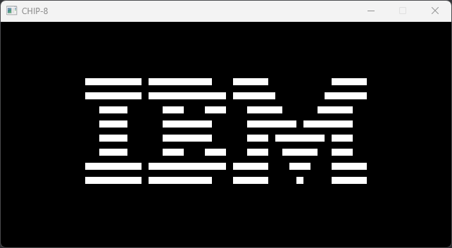

## Overview
A CHIP-8 interpreter implemented in Rust. It supports executing CHIP-8 programs (file extension .ch8), but keep in mind that not all programs may work as expected, and audio is not supported.



## Getting Started
To run the Chip8 interpreter, you'll need to have Rust installed on your system. You can download rustup from https://rustup.rs/.

Since SDL2 is compiled from source, you'll need a C compiler (like `gcc`, `clang`, or `MSVC`) along with CMake.

Once the prerequisities are installed, follow these steps:

1. Clone this repository, including the roms submodule by running 
```
git clone --recurse-submodules https://github.com/elias-ka/chip8
```

2. Navigate to the project directory.

3. Run the interpreter with the following command:
```
cargo run --release -- <path-to-chip8-program>
```

## Controls
The Chip8 system originally used a 16-key hexadecimal keypad. However, this interpreter maps the original keypad to modern keyboard keys as follows:

```
Chip8 Keypad   Keyboard
------------   --------
1 2 3 C        1 2 3 4
4 5 6 D    =>  Q W E R
7 8 9 E        A S D F
A 0 B F        Z X C V
```

## Demos
### Ping Pong

### Bouncing sprites


## License
This project is licensed under the MIT License. See the LICENSE file for more details.

## Acknowledgments
The Chip8 system was originally designed by Joseph Weisbecker.


